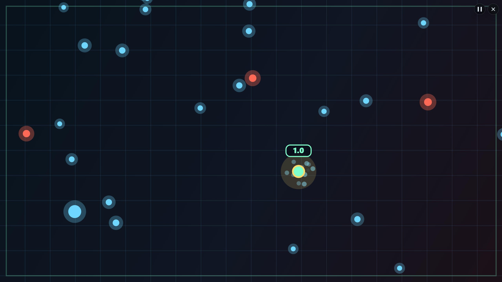

# 弹幕漂移

一个轻量的 Canvas 网页小游戏。玩家控制绿色主角球，在逐步增强的弹幕中尽可能存活更久，拾取道具改变局势，并争取刷新最高分。

[立即游玩](https://magy-rlof.github.io/bullet-drift/)



## 玩法

- 躲避蓝色和红色敌对球，存活越久分数越高。
- 弹幕节奏会从热身、压迫、混合逐步推进到爆发。
- 碰撞失败后显示本局得分、存活时间和最高分。
- 刷新最高分时会显示“新纪录”反馈。
- 最高分和语言偏好保存在当前浏览器的 `localStorage`。

## 道具

- `C`：清除场上敌对球。
- `S`：短时间免疫碰撞。
- `L`：大幅减速敌对球。

时效道具会在主角球附近显示紧凑数字倒计时，数字颜色与道具球颜色一致。

## 操作

- 移动：`WASD` 或方向键。
- 开始 / 重新开始：`Space` 或页面按钮。
- 暂停 / 继续：`P` 或暂停按钮。
- 桌面全屏：点击页面上的全屏按钮进入，全屏后可用右上角按钮或 `Esc` 退出。
- 触控 / 指针：在场地内相对拖动，手指不必压在主角球上。
- 手机端：横屏默认进入游戏全屏布局；竖屏显示规则说明和横屏提示。

## 本地运行

这个项目不需要安装依赖，可以直接用浏览器打开 `index.html`。更推荐启动本地服务器：

```bash
node server.mjs
```

然后打开：

```text
http://127.0.0.1:4173
```

如果 `4173` 端口被占用，可以指定其他端口。

PowerShell：

```powershell
$env:PORT=4180; node server.mjs
```

macOS / Linux：

```bash
PORT=4180 node server.mjs
```

## 清理本地记录

测试最高分反馈时，可以打开：

```text
http://127.0.0.1:4173/?resetData=1
```

页面会清理本游戏的 `bullet-drift-*` 本地数据，并自动移除地址栏里的 `resetData` 参数。

## 设备支持

- 支持桌面浏览器、普通手机和 iPad Pro 等大屏触控设备。
- 桌面端支持窗口模式和全屏模式。
- 手机端以横屏游玩为主，竖屏用于提示和规则说明。
- Nest Hub / Nest Hub Max 仅作为大屏横屏预览，不保证竖屏说明页或完整操作体验。

## 项目文档

- [PRODUCT.md](PRODUCT.md)：产品范围、核心循环和验收标准。
- [DESIGN.md](DESIGN.md)：界面设计原则和状态设计。
